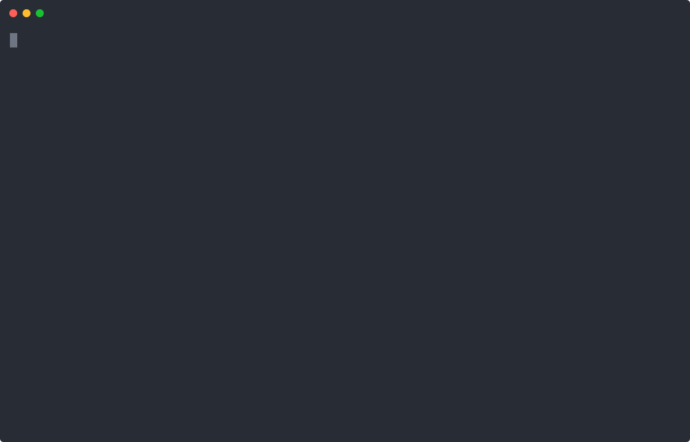

<div align="center">

# 🍽️ tray

**A task tracker in two layers.**
One for quick one-line thoughts.
One for tasks you pick onto your tray.

</div>

---

Most task apps ask you to file a thought the moment you have it — a project, a
priority, a due date — which is exactly when you know least about it. So you either
answer three questions you can't answer yet, or you don't write it down at all.

tray keeps those two jobs apart:

**🗑️ The garage** — for quick one-line task thoughts for later.

**🍽️ The tray** — for tasks on your plate right now.

Moving a line from one to the other is the one moment it gets organised, and only the
few that graduate ever need it.

```sh
go install github.com/cheese-cracker/tray/cmd/tray@latest

tray init                      # creates ~/tray/
tray dump the billing page is slow    # capture, zero ceremony
tray                           # open it
```

## 🎯 What it's for

- **🖥️ One tool, two interfaces.** A full-screen TUI for you; a plain-text CLI for your
  agents.
- **📅 Structure only when it helps.** A line starts as a scribble and becomes a real
  task — priority, due date, tags — at the moment you pick it up.
- **📐 Standard shapes, not invented ones.** One task per line with `+tags` and
  `key:value` fields, in the spirit of todo.txt; field names and urgency from
  Taskwarrior, so an export imports cleanly. The database is a markdown file.
- **🔌 Plays with what you already use.** Calendars, trackers, other task tools, via
  plugins. *Not built yet.*
- **⚖️ Few things well.** Inspired by the Eisenhower matrix. The tray is meant to be
  the small list of deliberate tasks.
- **⏭️ Forward-looking, not an archive.** tray is for the tasks still ahead of you. It
  is not built to help you find what you finished last quarter — finished lines stay in
  the file as a record, out of the way of the list you actually work from.

## The interface

Bare `tray` on a terminal opens it.



Above: a jotting taken onto the tray with `t` and given structure, a task added
straight to the tray with `a`, and one finished with `x`.

The tray is **ordered, not sorted by hand** — Taskwarrior's urgency formula ranks it
from priority, due date and age. The figure itself isn't a column: it decides the order
and there is nothing you would do with the number. `tray list` prints it for agents, and
`columns` in `internal/ui/row.go` is one line if you want it back on screen.

**Two tabs, day to day:** what you're doing, and what you dumped this month. Tray rows
carry the same checkbox their file does — `[ ]` and `[x]`. Garage lines have no checkbox
in the file, so they don't grow one on screen.

| | |
|---|---|
| `↑` `↓` | move — `j` `k` also work |
| `tab` | switch layer, cycling at either end. `⇧tab` goes back |
| `space` | select. Actions apply to your selection, or to the row under the cursor |
| `enter` | the action menu — take, rewrite, done, hand back, move |
| `r` | rewrite. On the tray that's every field; **in the garage it's the words alone** |
| `a` | add — a bare line in the garage, the full form on the tray |
| `t` | take a garage line onto the tray, and give it structure |
| `v` | review — everything on the layer, live and finished. The frame changes colour, and it is the only place `R` restore and `E` erase exist. `v` or `esc` leaves |
| `/` | filter · `?` help · `q` quit |

Setting a priority on a garage line means you want it on the tray — so the garage
form doesn't offer one. `t` is how you say that, and it carries the line across.

Press **`?`** for a full-screen explainer: what the two layers are, and every key.

## Features

- 🗂️ **Two layers** — a garage that asks nothing of you, a tray that expects structure.
- 📝 **Plain markdown**, one task per line (`~/tray/`). Edit it in any editor — tray
  keeps whatever it doesn't recognise, byte for byte.
- 🗓️ **A garage per month** — dump into November in August, if that's when you'll do it.
- 🔁 **A month-turn sweep** — `tray carryover` opens the months as tabs so you can triage
  what's left before it rolls forward.
- ♻️ **Finishing marks, it doesn't move.** A done line is struck through where it sits.
- 👁️ **`v` is review mode** — the whole layer, done and not, with the frame in a second
  colour so you can see you left the daily screen. The only place the rare verbs live:
  `R` restores one you finished by accident, `E` erases one that should never have been
  written. Behind a mode is how they stay out of the way of the flow.
- 🔍 **`/` fuzzy filter** over text and tags, and `tray find` across every month at once —
  a line that keeps reappearing is a rot signal you get for free.
- ✍️ **One form to restructure**, every field prefilled, so only what you touch changes.
- 📊 **Taskwarrior's urgency formula and field names** — it ranks your tray for you,
  and `tray export | task import` just works.
- 🐚 **`tray head` for your shell profile** — the top few tasks on every new terminal,
  and completely silent when the tray is empty.
- 📦 **One static binary.** Nothing needed at runtime.

## The files

```
~/tray/                 $TRAY_HOME overrides this
  tray.md               the worklist
  2026-08.md            this month's garage
  someday.md            explicitly undated
```

```markdown
# tray.md
- [ ] the billing page feels slow on first load priority:H due:2026-08-31 from:2026-08 +work
- [ ] Rotate the api keys priority:H due:2026-09-01 entry:2026-08-24 +infra
- [x] ~~Renew the TLS certificate~~ priority:H entry:2026-08-20 done:2026-08-29 +infra

# 2026-08.md
- add metrics to the sync worker +infra
- the billing page feels slow on first load → tray
- ask whether the offsite dates are fixed yet
- someone should own the status page
```

The files are the truth and you are meant to edit them. Attributes are read off the
**end** of a line and only for known keys, so a colon mid-sentence survives — which is
what lets the garage hold prose. `→ tray` marks a line whose live copy moved elsewhere;
the line itself stays as history.

<details>
<summary><b>🤖 The CLI — the surface for agents</b></summary>

<br>

Piped, `tray` never opens a UI and never prompts, so an agent can drive every part of
it. This is the same tool and the same files — just the half you don't have to look at.

### Capture and create

| | |
|---|---|
| `tray dump <text>` | A line in this month's garage. **The tail is literal** — colons, dashes and half-sentences all survive. |
| `tray dump to:2026-11 +infra <text>` | A leading `to:` and `+tag` are the only things parsed. |
| `tray add <desc> pri:H due:2026-08-12 +infra` | Straight onto the tray, for something already live. |

> **Quote anything the shell would eat.** `tray dump ?? does this matter` fails in zsh —
> `??` is a glob. Use `tray dump '?? does this matter'`. Same for `!` and `*`.

### Moving between layers

| | |
|---|---|
| `tray 3 take [pri:H +infra]` | Garage → tray. Where a jotted pointer becomes a real task. |
| `tray 2 rewrite pri:M +blocked -infra` | Restructure a task — the verb the TUI's `r` runs. Exact and scriptable; what agents use. |
| `tray unload --to 2026-09` | Hand the whole tray back to a month. **The month is never guessed** — bare `tray unload` picks it on a terminal and errors when piped. Finished items land struck through; open ones keep what the tray gave them. |
| `tray 2 unload --to 2026-09` | One item. |

### Finishing

| | |
|---|---|
| `tray 1 done` | Struck through in place, dated. Never moved. |
| `tray 2,5-7 done` | Ranges, like Taskwarrior. |
| `tray 2 restore` | Says it wasn't finished after all. |
| `tray 4 erase` | **Removes the line.** The one verb that does — for something typed twice, or typed wrong. |

> `restore` and `erase` both reach lines the default report hides, so both resolve ids
> against `tray list --all`. In the TUI these two live behind `v`; the CLI doesn't gate
> them, the same way `rewrite` will set a priority in the garage.

### Editing

| | |
|---|---|
| `tray 2 edit <new text>` | Rewrite one line's text, attributes untouched. |
| `tray edit` · `tray garage edit` | Open the file in `$EDITOR`. |

`rewrite` will set a priority on a garage line, where the TUI's form won't offer one.
That asymmetry is deliberate: the interface guides a habit, the CLI doesn't police it —
the files are yours either way, and an agent tidying one shouldn't have to argue with
the tool.

### Reading

| | |
|---|---|
| `tray` | Grouped bullets with ids when piped. |
| `tray list` · `tray list --all` | The dense table; `--all` includes the `✓` finished ones. |
| `tray garage list` | This month's jottpad. |
| `tray +infra list` · `tray due:2026-08-12 list` | Filters. |
| `tray find <text>` | Every layer, every month at once. |
| `tray print` | Plain `- [ ]` bullets grouped by tag, for a journal. |
| `tray export` | JSON in Taskwarrior's import shape. |
| `tray head [n]` | The top few, compactly. Silent on an empty tray. |
| `tray status` | Where you stand, and any earlier month still holding live lines. |

### The month turn

Two commands, in order — `carryover` is month → month and never touches your tray:

```sh
tray unload --to 2026-08                 # close the tray out into the month that ended
tray carryover --run --month 2026-08     # its leftovers move to September
```

**The month is never inferred.** Sweeping August into September is the same job whether
you do it on the 30th, when August is current, or on the 10th, when it is previous — so
`--run` requires `--month`, and `tray status` prints the exact line to run.

Carryover is **copy-forward**: the source line stays, annotated `→ 2026-09`, which is
what makes month files a record and `tray find` a rot detector. A due date that has
already passed is not carried.

### Field reference

| Field | Meaning |
|---|---|
| `priority:` | `H` / `M` / `L`. `pri:` also works |
| `due:` | `YYYY-MM-DD` on disk; shown with the weekday |
| `entry:` | created, feeds the age term in urgency |
| `from:` | which garage month it graduated from |
| `done:` | finished, with the date. The only terminal state |
| `+tag` | `#tag` is read too, `+tag` is written |
| `→ 2026-09` / `→ tray` | this line's live copy moved elsewhere; the line itself is history |

Ids are positional and computed per report, never stored, so reordering a file by hand
can't desync anything.

</details>

## In your shell

`tray head` prints the top of your tray and **nothing at all** when it's empty, so a
clear day costs a fresh terminal no lines.

```zsh
# ~/.zshrc
[[ -o interactive && -t 1 ]] && command -v tray >/dev/null && tray head
```

```
╭─ tray ───────────────────────────────────────────╮
│ H  Rotate the api keys                   3d over │
│ H  Book the flights                          Mon │
│ M  Review the deploy checklist           3d over │
╰──────────────────────────────────────────────────╯
```

---

[FLOWS.md](FLOWS.md) is what must keep working, and the test that holds each promise.
[DECISIONS.md](DECISIONS.md) is why things are the way they are.
[ROADMAP.md](ROADMAP.md) is what's next.
