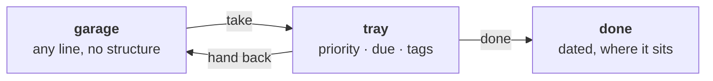

<div align="center">

# 🍽️ tray

**A task tracker in two layers.**
One for quick one-line thoughts.
One for tasks you pick onto your tray.

</div>

---

Most task apps ask you to file a thought the moment you have it — a project, a
priority, a due date — which is exactly when you know least about it. So you either
answer three questions you can't answer yet, or you don't write it down at all.

tray keeps those two jobs apart. Write anything into the garage. Move it to the tray
when you are ready to work on it, and answer the three questions then — only the few
lines that graduate ever need an answer.


```mermaid
flowchart LR
  G["<b>garage</b><br/>any line, no structure"]
  T["<b>tray</b><br/>priority · due · tags"]
  D["<b>done</b><br/>dated, where it sits"]
  G -- "take" --> T
  T -- "hand back" --> G
  T -- "done" --> D
```

```sh
go install github.com/cheese-cracker/tray/cmd/tray@latest

tray init                             # creates ~/.local/share/tray/
tray dump the billing page is slow    # capture, zero ceremony
tray                                  # open it
```

## The interface

Bare `tray` on a terminal opens it.


The tray orders itself by priority, due date, and age. The dim number at the left of
every row is the task's id — four characters, permanent, and what `tray k79l done` means.
Press **`S`** to sync: recurring tasks, waiting lines and what you typed into `garage.md`
all land.

| | |
|---|---|
| `↑` `↓` | move — `j` `k` also work |
| `tab` | switch layer, cycling at either end. `⇧tab` goes back |
| `space` | select. Actions apply to your selection, or to the row under the cursor |
| `enter` | the action menu — take, rewrite, done, hand back, move |
| `r` | rewrite. On the tray that's every field; **in the garage it's the words alone** |
| `a` | add — a bare line in the garage, the full form on the tray |
| `t` | take a garage line onto the tray, and give it structure |
| `#` | tag — the tag field alone, on either layer. The footer names it in the garage, where it is the only structure on offer |
| `n` | note — a few lines of context under the task. `≡` in the row says one is there |
| `v` | review — everything on the layer, live and finished, waiting lines with their day, templates `↻`. The frame changes colour, and it is the only place `R` restore and `E` erase exist. `v` or `esc` leaves |
| `S` | sync — the one event, by hand: templates, waiting lines and `garage.md` land |
| `/` | filter · `?` help · `q` quit |

Setting a priority on a garage line means you want it on the tray — so the garage
form doesn't offer one. `t` is how you say that, and it carries the line across.

Press **`?`** for a full-screen explainer: what the two layers are, and every key.

## Features

- 🗂️ **Two layers.** The garage takes any line. The tray asks for a priority, a due
  date and tags, and only when you move a line onto it.
- 🪜 **Structure in steps.** Words, then a tag, then the three questions, then a note,
  then a schedule — each when you are ready, never before.
- 🗄️ **One private database, one open mirror.** SQLite in `~/.local/share/tray/`, and
  beside it `tray.md` and `garage.md`: one `- (id) words` bullet per open task, rewritten
  after every write. Drop the folder in a vault and read your tray from a phone; add a
  bullet to `garage.md` there and the next sync brings it in.
- 🗓️ **A garage per month, and dates that act.** Dump into November in August. A line
  with `wait:` lies in the garage until its day and then lands on the tray. A template
  with `recur:` keeps one live child of itself.
- 🔍 **Filter and search.** `/` narrows the list as you type. `tray find` reaches every
  layer and every month at once.
- 👁️ **Review mode.** `v` shows finished lines beside live ones, and is the only place
  you can restore or erase.
- 🔗 **Imports and exports both ways.** `tray export | task import` works, and so does
  `task export | tray import`. todo.txt too, and markdown bullets for a journal.
- ⚡ **One event.** Nothing runs on its own. `sync` materializes what is due, lifts what
  was waiting, reads `garage.md` back and asks each plugin what it sees; what comes from
  outside lands only when you say so, whole.
- 🔌 **Plugins on a one-file contract.** A folder with a `sync` executable is a garage
  that fills itself. Verbs under `actions/` join the `enter` menu.
- 🐚 **A header for your shell.** `tray head` prints your top tasks in a new terminal,
  and nothing at all when the tray is empty.
- 📦 **One static binary.** Nothing to install at runtime.

<details>
<summary><b>🐚 Wiring <code>tray head</code> into your shell</b></summary>

<br>

```zsh
# ~/.zshrc
[[ -o interactive && -t 1 ]] && command -v tray >/dev/null && tray head
```

```
╭─ tray ───────────────────────────────────────────╮
│ H  Rotate the api keys                   Sat Oct 3 │
│ H  Book the return flight                    Thu │
│ M  Cancel the unused subscription      Sat Oct 10 │
╰──────────────────────────────────────────────────╯
```

Silent on an empty tray, so a clear day costs a fresh terminal no lines. `tray head 5`
for more rows.

</details>

## The database

```
~/.local/share/tray/    $TRAY_HOME overrides this ($XDG_DATA_HOME/tray if that is set)
  tray.db               every task, every layer, every month
  tray.md               the open tray tasks, one `- (id) words` bullet each — written, never read
  garage.md             the open garage lines under `## 2026-09` headings — written, and read back on sync
  plugins/              one folder per plugin
```

`tray init` creates it and prints where it is. You never open `tray.db` by hand — the
grammar you knew from the files is now the CLI's and the exports': `+tag` and
`key:value` on the way in, markdown, todo.txt or Taskwarrior JSON on the way out.

### The config file

`~/.config/tray/config.yaml` (`$XDG_CONFIG_HOME/tray/config.yaml`, or `$TRAY_CONFIG`).
`tray init` writes it with every key empty, and tray without it is tray as before —
nothing here is needed to install or use it:

```yaml
openrouter:
  api_key: ""        # or OPENROUTER_API_KEY. Not needed to install tray — plugins read it
  model: ""          # or OPENROUTER_MODEL
dates:
  format: ""         # reserved; parsed, unused for now
```

`tray config` prints the path and the effective values, secrets cut to their last four
characters, and says which came from the environment (`OPENROUTER_API_KEY` and
`OPENROUTER_MODEL` override the file). Plugins see the keys as `TRAY_OPENROUTER_API_KEY`
and `TRAY_OPENROUTER_MODEL`; they never read the file.

Where the data lives is not a config matter. The store is `$TRAY_HOME/tray.db`, full
stop, and a save never waits on anything but this disk. A copy of it somewhere else — a
Turso database, a phone — is a plugin's job, and it arrives the way everything from
outside does: as a plan you review, with the local row winning.

The two `.md` files are the **mirror**: the lightest view of your tasks there is, and the
reason the folder can sit inside an Obsidian vault. Every write rewrites them. On the next
`sync`, a bullet you added to `garage.md` with no id becomes a new line in the month it
sits under (this month above any heading), and a bullet whose words you changed renames
its task. Nothing else is read — not tags, not a deleted line, and never `tray.md`: the
tray is not for adding to on a whim. A `garage.md` you have edited is never written over
before it is read: the status line says so, and `S` or `tray sync` brings it in.

Coming from a markdown home:

```sh
tray import --format md ~/tray
```

reads `tray.md`, every `YYYY-MM.md`, `someday.md` and any plugin's `<name>.md`. Struck
or `[x]` lines arrive finished, indented lines arrive as notes, `→` lines are history
and are skipped — their live copy is already elsewhere. Running it twice adds nothing.
`~/tray` is left as it was.

<details>
<summary><b>🤖 The CLI — the surface for agents</b></summary>

<br>

Piped, `tray` never opens a UI and never prompts, so an agent can drive every part of
it. Same tool, same database, in the half you never have to look at.

### Capture and create

| | |
|---|---|
| `tray dump <text>` | A line in this month's garage. **The tail is literal** — colons, dashes and half-sentences all survive. |
| `tray dump to:2026-11 +infra <text>` | A leading `to:` and `+tag` are the only things parsed. |
| `tray add <desc> pri:H due:2026-10-03 +infra` | Straight onto the tray, for something already live. Says what it still lacks. |
| `tray add <desc> wait:2027-03-13` | Into the garage of that month; the first `sync` on or after the day lifts it onto the tray. |
| `tray add <desc> recur:weekly due:2026-10-03` | A template. `sync` keeps one live child of it, due one period on, skipping periods you missed. `daily weekly monthly yearly`, or `2w`, `10d`. `until:` ends it; so does `done` on the template. |
| `tray dump --note <text> <desc>` · `tray add --note <text> …` | With a note. On `dump` it is one of the leading tokens, like `to:` and a tag. |

> **Quote anything the shell would eat.** `tray dump ?? does this matter` fails in zsh —
> `??` is a glob. Use `tray dump '?? does this matter'`. Same for `!` and `*`.

### Moving between layers

| | |
|---|---|
| `tray k79l take [pri:H +infra]` | Garage → tray. Where a jotted pointer becomes a real task. The row remembers the month it left. |
| `tray k79l rewrite pri:M +blocked -infra` | Restructure a task — every field, `recur:` `wait:` `until:` too. Exact and scriptable; what agents use. |
| `tray unload --to 2026-09` | Hand the whole tray back to a month. **The month is never guessed** — bare `tray unload` picks it on a terminal and errors when piped. |
| `tray k79l unload` | One task, back to the month it came from. |
| `tray carryover --run --month 2026-08` | That month's live leftovers move to the next month. A due date that has already passed is dropped on the way. `--month` is required, and `tray status` prints the line to run. On a terminal, bare `tray carryover` opens the months as tabs instead. |

### Finishing

| | |
|---|---|
| `tray k79l done` | Dated, in place. Never moved. |
| `tray k79l,79ya done` | Several at once, comma separated. |
| `tray k79l restore` | Says it wasn't finished after all. No trace. |
| `tray k79l erase` | **Removes the row.** The one verb that does — for something typed twice, or typed wrong. |

### Editing

| | |
|---|---|
| `tray k79l edit <new text>` | The words alone, everything else untouched. |
| `tray k79l note <text>` · `tray k79l note` | Replace the note, or print it. |

`rewrite` will set a priority on a garage line, where the interface's form won't offer
one. That asymmetry is deliberate: the interface guides a habit, the CLI doesn't police
it — the rows are yours either way, and an agent tidying them shouldn't have to argue
with the tool.

### Reading

| | |
|---|---|
| `tray` | Grouped bullets by tag, ids on the left. |
| `tray list` · `tray list --all` | The dense table with urgency; `--all` adds the finished `✓`, the waiting, and templates `↻`. |
| `tray garage list` · `tray garage list --month 2026-11` | This month's jottpad, or another's. |
| `tray +infra list` · `tray due:2026-10-03 list` | Filters. |
| `tray find <text>` | Every layer, every month at once; finished rows under `--all`. |
| `tray print` | Plain `- [ ]` bullets grouped by tag, for a journal. |
| `tray head [n]` | The top few, compactly. Silent on an empty tray. |
| `tray status` | Where you stand: live, waiting, templates, any earlier month still holding live lines, the last sync and any plugin that failed. |
| `tray context [ids]` | The report with ids and every note under its task — for pasting to an agent. |

### In and out

| | |
|---|---|
| `tray export` · `tray export --all` | Taskwarrior's import shape, plus `id`. `tray export \| task import` works. |
| `tray export --format todotxt` | `(A) 2026-09-28 Renew cert +infra due:2026-10-03`. Notes have no line there and are left out, and it says so. |
| `tray export --format md` | The `print` bullets. |
| `tray import --format tw <file\|->` · `--format todotxt` | The reverse. A `project` comes in as a tag, a `uuid` updates the row it names, a line with structure lands on the tray and a bare one in this month's garage. |
| `tray import --format md ~/tray` | The migration above. |

### The event

| | |
|---|---|
| `tray sync` | The event, by hand: materializes due recurrences, lifts waiting rows whose day has come, reads `garage.md` back, then asks every plugin for its plan and prints them — adds, changes, pushes, evidence. **Nothing from a plugin lands here.** |
| `tray sync --apply` | Lands every plan, each one whole or not at all, and hands the confirmed pushes back to its plugin. |
| `tray sync --plugin <name>` · `--json` · `--timeout 10m` | One plugin; the same as JSON; how long a plugin may take. |
| `tray plugin` · `tray plugin check [name]` | The health view: state, hooks, settings, last run — external folders and core plugins alike. `check` runs each `health` probe first. `--json` for agents. |
| `tray plugin run <name>` | One plugin's plan, printed, landing nothing. |
| `tray plugin set <name> key=value…` | Writes its `settings.json` — only keys its `settings.example.json` names, when it has one. |

### Field reference

| Field | Meaning |
|---|---|
| `priority:` | `H` / `M` / `L`. `pri:` also works. Unset reads as medium |
| `due:` | `YYYY-MM-DD` on the wire; shown with the weekday |
| `wait:` | the day a garage line lands on the tray |
| `recur:` · `until:` | the period a template repeats on, and when it stops |
| `entry:` | created, feeds the age term in urgency |
| `from:` | which garage month it graduated from; where `unload` returns it |
| `done:` | finished, with the date. The only terminal state |
| `+tag` | `#tag` is read too, `+tag` is written. A `project` on any wire becomes one |
| indented lines | the task's note, on the markdown wire. One note, any length. One Taskwarrior annotation; nothing in todo.txt |

Ids are four characters — base36, always with a digit, so a four-letter word is never
one — printed first in every report and never handed out twice. `tray k79l` means the
same task tomorrow, in a filter, in an export, in the interface's first column, and in
the mirror's parentheses.

</details>

## Events, hooks and plugins

Nothing runs on its own. tray acts on two events — a **write** to the store, and a
**sync** you ask for (`tray sync`, `S`) or an interface fires on opening — and a hook is
one thing that answers an event. The built-in hooks are one table in
`internal/sync/hooks.go`: `recur`, `lift`, `garage.md`, then the `mirror`, in that order.
A plugin is a hook on sync too, run after them, in its own process, with its plan shown
before anything lands. [`plugins/README.md`](plugins/README.md) has the table.

A plugin is a folder under `plugins/`, and the folder is the manifest. A `sync`
executable makes it a garage that fills itself: `sync plan` prints what it sees and what
it would push back, tray shows you the diff, and `sync apply` runs only after you land
it. Executables under `actions/` become rows in the `enter` menu and get the terminal
while they run. `settings.example.json` names what it needs; an `on-launch` file means
it also runs when the interface opens; an `all-rows` file means it reads the whole store,
the way a replica must. A `health` executable is the probe `tray plugin check` runs; `tray
plugin` is the health view — every folder with its state, the hooks it joins and its last
run, beside the **core plugins** tray ships with, off until the config file turns them on
(`openrouter` is the first: no key, no agent, and tray is whole without either). The
contract is [`plugins/README.md`](plugins/README.md).

Whatever a plugin brings back lands the same way: as a plan you review, with the local
row winning. That is what keeps tray offline-first — the store is this disk, and a copy
of it anywhere else is a plugin's concern. Plugins live in their own repos: `tray-gcal`
(a verb that books a time), `tray-turso` (a replica of your tasks on Turso, local wins).
Next in line: a web garage (a URL and a ruleset, a browser does the rest), voice, a
board's API, and Claude conversations compacted into a task's note.

## 🎯 What it's for

- **🖥️ One tool, two interfaces.** A full-screen TUI for you; a plain-text CLI for your
  agents. The CLI is also the API everything else calls.
- **🪜 Iteratively clearer.** A task starts as a few words and gains structure in steps
  — a tag, then a priority and a date when you take it, then a note, then the context
  an agent needs. Each step when you are ready, never before. Outside data enters at
  the bottom.
- **📐 Grammar is for the wire, not the disk.** `+tags` and `key:value` on the CLI and
  in every import and export, in the spirit of todo.txt and with Taskwarrior's names.
  The database is SQLite, private, never hand-edited.
- **🔌 Plays with what you already use.** Calendars, boards, other task tools, via
  plugins. A folder is the manifest. You run `sync`; they do the rest.
- **⚖️ Few things well.** Inspired by the Eisenhower matrix. The tray is meant to be
  the small list of deliberate tasks. No history, no archive views: done is a date,
  erase deletes.
- **⏭️ Forward-looking, not an archive.** tray is for the tasks still ahead of you.
  Finished rows stay for review, out of the way of the list you actually work from.
- **⚡ Event-driven.** Nothing runs on its own. `sync` is the one event — what is due
  lands, waiting rows lift, plugins report — fired by you.
- **🔍 Outside data lands through a reviewed diff.** Sync shows what would change; you
  apply all of it or none. Never silent, never partial. A failing plugin fails alone.

---

[FLOWS.md](FLOWS.md) is what must keep working, and the test that holds each promise.
[DECISIONS.md](DECISIONS.md) is why things are the way they are.
[ROADMAP.md](ROADMAP.md) is what's next.

Built with [Bubble Tea, Bubbles, and Lip Gloss](https://charm.sh) from Charm and
[modernc.org/sqlite](https://gitlab.com/cznic/sqlite), and recorded with
[asciinema](https://asciinema.org). The task grammar takes its shape from
[todo.txt](https://github.com/todotxt/todo.txt) and its field names from
[Taskwarrior](https://taskwarrior.org).
