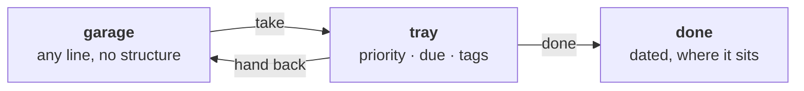

<div align="center">

# 🍽️ tray

**A task tracker in two layers.**
One for quick one-line thoughts.
One for tasks you pick onto your tray.

</div>

---

Most task apps ask you to file a thought the moment you have it — a project, a
priority, a due date — which is exactly when you know least about it. So you either
answer three questions you can't answer yet, or you don't write it down at all.

tray keeps those two jobs apart. Write anything into the garage. Move it to the tray
when you are ready to work on it, and answer the three questions then — only the few
lines that graduate ever need an answer.


```mermaid
flowchart LR
  G["<b>garage</b><br/>any line, no structure"]
  T["<b>tray</b><br/>priority · due · tags"]
  D["<b>done</b><br/>dated, where it sits"]
  G -- "take" --> T
  T -- "hand back" --> G
  T -- "done" --> D
```

```sh
go install github.com/cheese-cracker/tray/cmd/tray@latest   # needs a C compiler and GL headers, see CONTRIBUTING

tray init                             # creates ~/.local/share/tray/
tray dump the billing page is slow    # capture, zero ceremony
tray                                  # open it
```

## The app

Bare `tray` on a desktop opens the window. Piped, it prints the report instead.


Home is one header line — `garage · tray` as pills, and at the right the quiet doors
`sync · plugins · ?` — a list, a pane, and a status bar under a hairline. A row shows
its actions when you hover or land on it — `take · tag · open` in the garage, `done ·
hand back · move · open` on the tray — and opening a row fills the pane with everything
it has so far: words, tags, then on the tray priority and due, the note, `schedule ▸` for
recur / wait / until, its source, and its id in grey. The empty rungs read as grey hints,
not prompts. The garage tab has a capture bar at the bottom: type, Enter, done.

`enter` on a row, or `:` anywhere, opens the **command palette**: every action that
applies right now, typed at — the row's verbs with their letters beside them, the modes,
every plugin's verbs, and, when your words name no command, *dump “…” into the garage*.
`/` brings the filter bar down when you want it; when a filter is on and you leave the
field, it folds to a pill beside the layers that says what it hid.

Anything simple is one step from the row. Anything that asks a question opens a form.
Anything that destroys, moves in bulk or brings data in has its own mode, with the way
out named at the top:

| Mode | In | Out | What it is for |
|---|---|---|---|
| **Review** | `v` | `v` · `esc` | everything on the layer — finished rows checked and grey, waiting rows with their day, templates named by their period. The only place `R` restore and `E` erase exist. The frame turns amber |
| **Sweep** | *carryover* in the garage tab | close | the months as tabs — prev · this · next · someday — with `>` and `t` to decide where each leftover goes, and one button that carries the named month forward |
| **Unload** | *hand the tray back* in the tray tab | pick · `esc` | a month picker, and the count it will move |
| **Sync review** | `s`, or a plugin at launch | apply all · discard | per plugin: what it would add, what it would change (old → new), what it would push back, the evidence it brought |
| **Plugins** | `p` | close | what is installed, how the last run went, the on-launch toggle, each plugin's settings form |

### Shortcuts

Letters are shortcuts for controls that are on screen — the TUI this grew out of taught
them because it had nothing else to show. They work while the list has the keys; a
field takes them as text.

| | |
|---|---|
| `↑` `↓` · `j` `k` | move |
| `tab` | switch layer, cycling at either end |
| `space` | select. Actions apply to your selection, or to the row under the cursor |
| `enter` · `:` · `ctrl+shift+p` | the command palette |
| `l` | open the pane |
| `t` | take a garage line onto the tray, and give it structure |
| `x` | done |
| `d` | hand back to the garage — it keeps what it learned |
| `>` | move to a month |
| `r` | rewrite. Every field, prefilled; with several selected, every field but the words |
| `#` | tag — the tag field alone, on either layer |
| `n` | note — a few lines of context under the task. A note sign at the row's end says one is there |
| `a` | add — the capture bar in the garage, the full form on the tray |
| `v` | review · `s` sync · `p` plugins · `c` copy context |
| `/` | filter — hidden until you ask · `esc` clears it, then quits · `?` help · `q` quit |

Press **`?`** for a page: what the two layers are, then the picture, then every key.

## Features

- 🗂️ **Two layers.** The garage takes any line. The tray asks for a priority, a due
  date and tags, and only when you move a line onto it.
- 🪜 **Structure in steps.** Words, then a tag, then the three questions, then a note,
  then a schedule — each when you are ready. The pane shows the rungs a task has not
  climbed yet and asks for none of them.
- 🗄️ **One private database.** SQLite, in `~/.local/share/tray/`. Nothing to hand-edit;
  markdown, todo.txt and Taskwarrior JSON are how tasks come in and go out.
- 🗓️ **A garage per month, and dates that act.** Dump into November in August. A line
  with `wait:` lies in the garage until its day and then lands on the tray. A template
  with `recur:` keeps one live child of itself.
- 🔍 **Filter and search.** `/` narrows the list as you type. `tray find` reaches every
  layer and every month at once.
- 👁️ **Review mode.** `v` shows finished lines beside live ones, and is the only place
  you can restore or erase.
- 🔗 **Imports and exports both ways.** `tray export | task import` works, and so does
  `task export | tray import`. todo.txt too, and markdown bullets for a journal.
- ⚡ **One event.** Nothing runs on its own. `sync` materializes what is due and asks
  each plugin what it sees; what comes from outside lands only when you say so, whole.
- 🔌 **Plugins on a one-file contract.** A folder with a `sync` executable is a garage
  that fills itself. Verbs under `actions/` join the menu.
- 🐚 **A header for your shell.** `tray head` prints your top tasks in a new terminal,
  and nothing at all when the tray is empty.
- 📦 **One binary.** Built with Fyne, so it links against your system's OpenGL and X11
  and needs nothing else at runtime.

<details>
<summary><b>🐚 Wiring <code>tray head</code> into your shell</b></summary>

<br>

```zsh
# ~/.zshrc
[[ -o interactive && -t 1 ]] && command -v tray >/dev/null && tray head
```

```
╭─ tray ───────────────────────────────────────────╮
│ H  Rotate the api keys                   Sat Oct 3 │
│ H  Book the return flight                    Thu │
│ M  Cancel the unused subscription      Sat Oct 10 │
╰──────────────────────────────────────────────────╯
```

Silent on an empty tray, so a clear day costs a fresh terminal no lines. `tray head 5`
for more rows.

</details>

## The database

```
~/.local/share/tray/    $TRAY_HOME overrides this ($XDG_DATA_HOME/tray if that is set)
  tray.db               every task, every layer, every month
  plugins/              one folder per plugin
```

`tray init` creates it and prints where it is. You never open `tray.db` by hand — the
grammar you knew from the files is now the CLI's and the exports': `+tag` and
`key:value` on the way in, markdown, todo.txt or Taskwarrior JSON on the way out.

Coming from a markdown home:

```sh
tray import --format md ~/tray
```

reads `tray.md`, every `YYYY-MM.md`, `someday.md` and any plugin's `<name>.md`. Struck
or `[x]` lines arrive finished, indented lines arrive as notes, `→` lines are history
and are skipped — their live copy is already elsewhere. Running it twice adds nothing.
`~/tray` is left as it was.

<details>
<summary><b>🤖 The CLI — the surface for agents</b></summary>

<br>

Piped, `tray` never opens a window and never prompts, so an agent can drive every part
of it. Same tool, same database, in the half you never have to look at.

### Capture and create

| | |
|---|---|
| `tray dump <text>` | A line in this month's garage. **The tail is literal** — colons, dashes and half-sentences all survive. |
| `tray dump to:2026-11 +infra <text>` | A leading `to:` and `+tag` are the only things parsed. |
| `tray add <desc> pri:H due:2026-10-03 +infra` | Straight onto the tray, for something already live. Says what it still lacks. |
| `tray add <desc> wait:2027-03-13` | Into the garage of that month; the first `sync` on or after the day lifts it onto the tray. |
| `tray add <desc> recur:weekly due:2026-10-03` | A template. `sync` keeps one live child of it, due one period on, skipping periods you missed. `daily weekly monthly yearly`, or `2w`, `10d`. `until:` ends it; so does `done` on the template. |
| `tray dump --note <text> <desc>` · `tray add --note <text> …` | With a note. On `dump` it is one of the leading tokens, like `to:` and a tag. |

> **Quote anything the shell would eat.** `tray dump ?? does this matter` fails in zsh —
> `??` is a glob. Use `tray dump '?? does this matter'`. Same for `!` and `*`.

### Moving between layers

| | |
|---|---|
| `tray 12 take [pri:H +infra]` | Garage → tray. Where a jotted pointer becomes a real task. The row remembers the month it left. |
| `tray 12 rewrite pri:M +blocked -infra` | Restructure a task — every field, `recur:` `wait:` `until:` too. Exact and scriptable; what agents use. |
| `tray unload --to 2026-09` | Hand the whole tray back to a month. **The month is never guessed** — piped, it is an error without `--to`; the app picks it. |
| `tray 12 unload` | One task, back to the month it came from. |
| `tray carryover --run --month 2026-08` | That month's live leftovers move to the next month. A due date that has already passed is dropped on the way. `--month` is required, and `tray status` prints the line to run. |

### Finishing

| | |
|---|---|
| `tray 12 done` | Dated, in place. Never moved. |
| `tray 12,15-17 done` | Ranges, like Taskwarrior. |
| `tray 12 restore` | Says it wasn't finished after all. No trace. |
| `tray 12 erase` | **Removes the row.** The one verb that does — for something typed twice, or typed wrong. |

### Editing

| | |
|---|---|
| `tray 12 edit <new text>` | The words alone, everything else untouched. |
| `tray 12 note <text>` · `tray 12 note` | Replace the note, or print it. |

`rewrite` will set a priority on a garage line, where the app's form won't offer one.
That asymmetry is deliberate: the interface guides a habit, the CLI doesn't police it.

### Reading

| | |
|---|---|
| `tray` | Grouped bullets by tag, ids on the left. |
| `tray list` · `tray list --all` | The dense table with urgency; `--all` adds the finished `✓`, the waiting, and templates `↻`. |
| `tray garage list` · `tray garage list --month 2026-11` | This month's jottpad, or another's. |
| `tray +infra list` · `tray due:2026-10-03 list` | Filters. |
| `tray find <text>` | Every layer, every month at once; finished rows under `--all`. |
| `tray print` | Plain `- [ ]` bullets grouped by tag, for a journal. |
| `tray head [n]` | The top few, compactly. Silent on an empty tray. |
| `tray status` | Where you stand: live, waiting, templates, any earlier month still holding live lines, the last sync and any plugin that failed. |
| `tray context [ids]` | The report with ids and every note under its task — for pasting to an agent. What the app's *copy context* copies. |

### In and out

| | |
|---|---|
| `tray export` · `tray export --all` | Taskwarrior's import shape, plus `id`. `tray export \| task import` works. |
| `tray export --format todotxt` | `(A) 2026-09-28 Renew cert +infra due:2026-10-03`. Notes have no line there and are left out, and it says so. |
| `tray export --format md` | The `print` bullets. |
| `tray import --format tw <file\|->` · `--format todotxt` | The reverse. A `project` comes in as a tag, a `uuid` updates the row it names, a line with structure lands on the tray and a bare one in this month's garage. |
| `tray import --format md ~/tray` | The migration above. |

### The event

| | |
|---|---|
| `tray sync` | Materializes due recurrences, lifts waiting rows whose day has come, then asks every plugin for its plan and prints them — adds, changes, pushes, evidence. **Nothing from a plugin lands here.** |
| `tray sync --apply` | Lands every plan, each one whole or not at all, and hands the confirmed pushes back to its plugin. |
| `tray sync --plugin <name>` · `--json` · `--timeout 10m` | One plugin; the same as JSON; how long a plugin may take. |
| `tray plugin` | What is installed: its garage, how many rows, how the last run went. |
| `tray plugin run <name>` | One plugin's plan, printed, landing nothing. |
| `tray plugin set <name> key=value…` | Writes its `settings.json` — only keys its `settings.example.json` names, when it has one. |

### Field reference

| Field | Meaning |
|---|---|
| `priority:` | `H` / `M` / `L`. `pri:` also works. Unset reads as medium |
| `due:` | `YYYY-MM-DD` on the wire; shown with the weekday |
| `wait:` | the day a garage line lands on the tray |
| `recur:` · `until:` | the period a template repeats on, and when it stops |
| `entry:` | created, feeds the age term in urgency |
| `from:` | which garage month it graduated from; where `unload` returns it |
| `done:` | finished, with the date. The only terminal state |
| `+tag` | `#tag` is read too, `+tag` is written. A `project` on any wire becomes one |
| indented lines | the task's note, on the markdown wire. One note, any length. One Taskwarrior annotation; nothing in todo.txt |

Ids are permanent integers, printed first in every report and never reused. `tray 12`
means the same task tomorrow, in a filter, in an export.

</details>

## Plugins

A plugin is a folder under `plugins/`, and the folder is the manifest. A `sync`
executable makes it a garage that fills itself: `sync plan` prints what it sees and what
it would push back, tray shows you the diff, and `sync apply` runs only after you land
it. Executables under `actions/` become rows in the menu. `settings.example.json` names
what it needs and the app asks for exactly that; an `on-launch` file means it also runs
when the app opens. The contract is [`plugins/README.md`](plugins/README.md).

No plugin ships on this branch yet. The order they will: a web garage (a URL and a
ruleset, a browser does the rest), voice, the calendar verb, a board's API, and Claude
conversations compacted into a task's note.

## 🎯 What it's for

- **🖥️ A desktop app for you, a CLI for your agents.** Simple actions are one step from
  the row; a question gets a form; anything with consequences gets a mode. The letters
  are shortcuts, not the design. The CLI is also the API everything else calls.
- **🪜 Iteratively clearer.** A task starts as a few words and gains structure in steps
  — a tag, then a priority and a date when you take it, then a note, then the context
  an agent needs. Each step when you are ready, never before. Outside data enters at
  the bottom.
- **📐 Grammar is for the wire, not the disk.** `+tags` and `key:value` on the CLI and
  in every import and export, in the spirit of todo.txt and with Taskwarrior's names.
  The database is SQLite, private, never hand-edited.
- **🔌 Plays with what you already use.** Calendars, boards, other task tools, via
  plugins. A folder is the manifest. You run `sync`; they do the rest.
- **⚖️ Few things well.** Inspired by the Eisenhower matrix. The tray is meant to be
  the small list of deliberate tasks. No history, no archive views: done is a date,
  erase deletes.
- **⏭️ Forward-looking, not an archive.** tray is for the tasks still ahead of you.
  Finished rows stay for review, out of the way of the list you actually work from.
- **⚡ Event-driven.** Nothing runs on its own. `sync` is the one event — what is due
  lands, waiting rows lift, plugins report — fired by you or by opening the app.
- **🔍 Outside data lands through a reviewed diff.** Sync shows what would change; you
  apply all of it or none. Never silent, never partial. A failing plugin fails alone.

---

[FLOWS.md](FLOWS.md) is what must keep working, and the test that holds each promise.
[DECISIONS.md](DECISIONS.md) is why things are the way they are.
[ROADMAP.md](ROADMAP.md) is what's next.

Built with [Fyne](https://fyne.io) and [modernc.org/sqlite](https://gitlab.com/cznic/sqlite).
The task grammar takes its shape from [todo.txt](https://github.com/todotxt/todo.txt)
and its field names from [Taskwarrior](https://taskwarrior.org).
